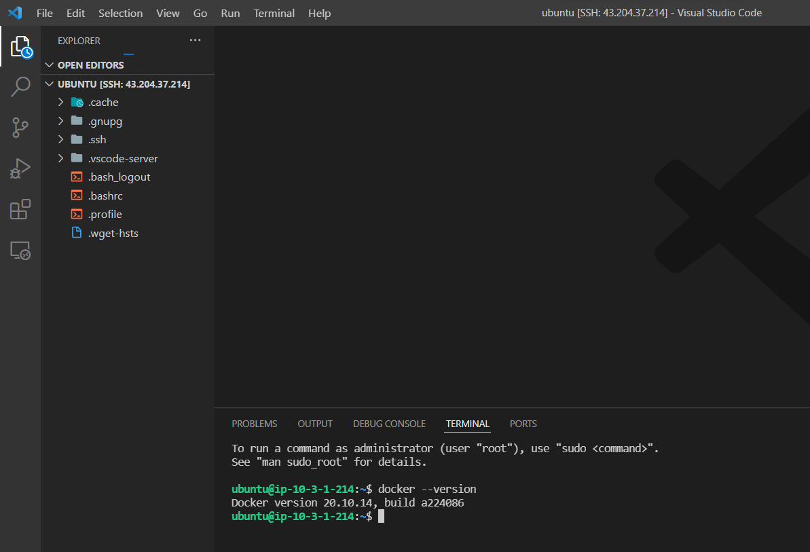

# Terraform Dev Environment setup for AWS instance

## Must Generate SSH keys and replace in ssh paths 

- Allows to ssh into AWS instance and have the environment setup on local windows/linux machine.
  

## Final Result

